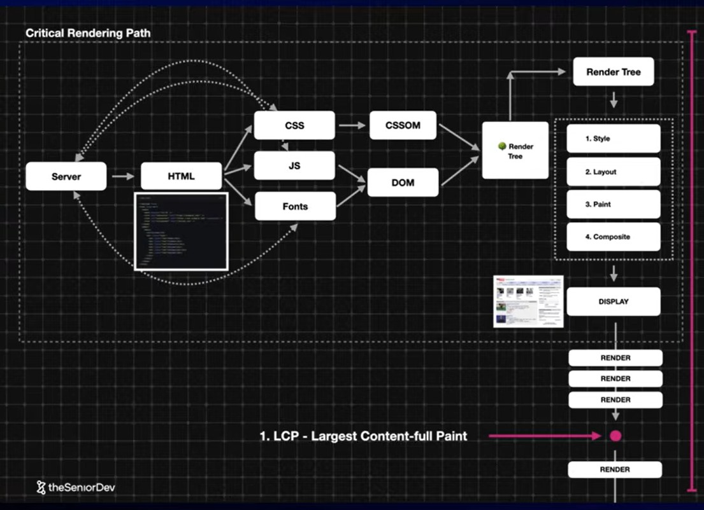

# 🚀 Frontend Performance Notes (Interview Ready)

---

# 1️⃣ Critical Rendering Path (CRP)

## Definition
The Critical Rendering Path is the sequence of steps the browser takes to convert HTML, CSS, and JavaScript into pixels on the screen.

## CRP Diagram

---

## Steps in CRP
1. Parse HTML → Build DOM  
2. Parse CSS → Build CSSOM  
3. Create Render Tree (DOM + CSSOM)  
4. Layout (Reflow)  
5. Paint  
6. Composite  

---

# 2️⃣ Optimizing a React Webpage

## Network Optimization
- Code Splitting
- Tree Shaking
- Compression (Gzip/Brotli)
- Image Optimization

## Rendering Optimization
- React.memo
- useMemo
- useCallback
- Virtualization

---

# 3️⃣ async vs defer

## async
- Downloads in parallel  
- Executes immediately after download  
- No order guarantee  

## defer
- Downloads in parallel  
- Executes after HTML parsing  
- Maintains order  

---

# 4️⃣ preload, prefetch, preconnect

- preload → Critical resource (high priority)  
- prefetch → Future resource (low priority)  
- preconnect → Establish connection early  

---

✅ End of Notes
